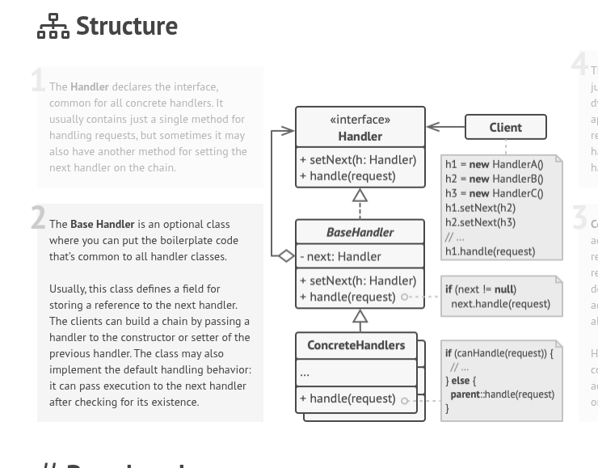

# Web server.

## Simple setup of server
```cpp
// handles /static/*, /favicon ico, /index.html
auto app = HttpAppBuilder{}
  .useStaticFiles("./www")
  .get("/api/health", [](auto& req){ return text("ok"); })
  .build();

HttpServer server = HttpServerBuilder{}
  .listen("0.0.0.0", 8080)
  .withApp(std::move(app))
  .build();

// epoll loop
server.run(); 
```

## Simple structer

- Net layer (no HTTP knowledge): accept sockets, epoll loop, per-connection read/write buffering
	- HttpServer (listen/epoll)
	- Connection (fd, inBuffer, outBuffer, state, i need keep connection till i will get \r\n\r\n sequence at the end of HTML)
- HTTP layer (pure parsing/formatting):
	- HttpRequest (method, target/path, headers, body)
	- HttpResponse (status, headers, body)
	- HttpParser (incremental: parse when \r\n\r\n is present; later add body support)
	- ResponseWriter (serialize headers + body bytes)
- App layer (your “framework”):
	- HttpApp: class for framework
	- Middleware: bool handle(const HttpRequest&, HttpResponse& out) (returns handled or not)
	- RouterMiddleware: exact match method+path -> handler
	- StaticFilesMiddleware(docRoot): serves /favicon.ico, /static/..., /app.js, etc
	- NotFoundMiddleware

#### SMall about middleware



## Simple UML for project:


#### UML for server
```
┌─────────────────────────────────────────────────────────────────────────────┐
│                              NET LAYER                                      │
├─────────────────────────────────────────────────────────────────────────────┤
│                                                                             │
│  ┌──────────────────┐         ┌────────────────────────┐                    │
│  │  «interface»     │         │  HttpServer            │                    │
│  │  IHttpServer     │◁────────│                        │                    │
│  ├──────────────────┤         ├────────────────────────┤                    │
│  │ +run()           │         │ -_listenFd: int        │                    │
│  └──────────────────┘         │ -_epfd: int            │                    │
│                               │ -_connections: map     │                    │
│                               │ -_app: HttpApp*        │                    │
│                               ├────────────────────────┤                    │
│                               │ +run()                 │                    │
│                               └───────────┬────────────┘                    │
│                                           │ owns many                       │
│                                           ▼                                 │
│  ┌──────────────────┐         ┌────────────────────────┐                    │
│  │  «interface»     │         │  HttpConnection        │                    │
│  │  IHttpConnection │◁────────│                        │                    │
│  ├──────────────────┤         ├────────────────────────┤                    │
│  │ +readIntoBuffer()│         │ -_fd: int              │                    │
│  │ +isCompleted()   │         │ -_buffer: string       │                    │
│  │ +isError()       │         │ -_state: State         │                    │
│  │ +getRequest()    │         │ -_reader: HttpReader*  │                    │
│  │ +queueResponse() │         │ -_writer: HttpWriter*  │                    │
│  └──────────────────┘         ├────────────────────────┤                    │
│                               │ +readIntoBuffer()      │                    │
│                               │ +isCompleted()         │                    │
│                               │ +getRequest()          │                    │
│                               │ +queueResponse()       │                    │
│                               │ -_reciveMessage()      │                    │
│                               └────────────────────────┘                    │
│                                                                             │
└─────────────────────────────────────────────────────────────────────────────┘

┌─────────────────────────────────────────────────────────────────────────────┐
│                              HTTP LAYER                                     │
├─────────────────────────────────────────────────────────────────────────────┤
│                                                                             │
│  ┌──────────────────┐         ┌────────────────────────┐                    │
│  │  «interface»     │         │  HttpReader            │                    │
│  │  IHttpReader     │◁────────│                        │                    │
│  ├──────────────────┤         ├────────────────────────┤                    │
│  │ +getRequest()    │         │ +getRequest(data)      │                    │
│  └──────────────────┘         │  → HttpRequest         │                    │
│                               └────────────────────────┘                    │
│                                                                             │
│  ┌──────────────────┐         ┌────────────────────────┐                    │
│  │  «interface»     │         │  HttpWriter            │                    │
│  │  IHttpWriter     │◁────────│                        │                    │
│  ├──────────────────┤         ├────────────────────────┤                    │
│  │ +writeResponse() │         │ +writeResponse(resp)   │                    │
│  └──────────────────┘         │  → string              │                    │
│                               └────────────────────────┘                    │
│                                                                             │
│  ┌────────────────────────┐   ┌────────────────────────┐                    │
│  │  HttpRequest           │   │  HttpResponse          │                    │
│  ├────────────────────────┤   ├────────────────────────┤                    │
│  │ +method: string        │   │ +status: int           │                    │
│  │ +path: string          │   │ +statusText: string    │                    │
│  │ +query: string         │   │ +headers: map          │                    │
│  │ +version: string       │   │ +body: string          │                    │
│  │ +headers: map          │   └────────────────────────┘                    │
│  │ +body: string          │                                                 │
│  └────────────────────────┘                                                 │
└─────────────────────────────────────────────────────────────────────────────┘

┌─────────────────────────────────────────────────────────────────────────────┐
│                              APP LAYER                                      │
├─────────────────────────────────────────────────────────────────────────────┤
│                                                                             │
│  ┌──────────────────┐         ┌────────────────────────┐                    │
│  │  «interface»     │         │  HttpApp               │                    │
│  │  IHttpApp        │◁────────│                        │                    │
│  ├──────────────────┤         ├────────────────────────┤                    │
│  │ +handle(req)     │         │ -_middleware: MW*      │                    │
│  │  → HttpResponse  │         ├────────────────────────┤                    │
│  └──────────────────┘         │ +handle(req)           │                    │
│                               │ +use(middleware)       │                    │
│                               └───────────┬────────────┘                    │
│                                           │ uses                            │
│                                           ▼                                 │
│                               ┌────────────────────────┐                    │
│                               │  «interface»           │                    │
│                               │  IMiddleware           │                    │
│                               ├────────────────────────┤                    │
│                               │ +setNext(mw)           │                    │
│                               │ +handle(req, resp)     │                    │
│                               │  → bool                │                    │
│                               └───────────┬────────────┘                    │
│                                           △                                 │
│                                           │                                 │
│                               ┌───────────┴────────────┐                    │
│                               │  BaseMiddleware        │                    │
│                               ├────────────────────────┤                    │
│                               │ #_next: IMiddleware*   │                    │
│                               ├────────────────────────┤                    │
│                               │ +setNext(mw)           │                    │
│                               │ #callNext(req, resp)   │                    │
│                               └───────────┬────────────┘                    │
│                                           △                                 │
│                     ┌─────────────────────┼────────────────────┐            │
│                     │                     │                    │            │
│       ┌─────────────┴─────┐   ┌───────────┴───────┐   ┌────────┴───────┐    │
│       │StaticFilesMiddle- │   │  RouterMiddleware │   │NotFoundMiddle- │    │
│       │ware               │   │  (future)         │   │ware            │    │
│       ├───────────────────┤   ├───────────────────┤   ├────────────────┤    │
│       │ -_docRoot: string │   │ -_routes: map     │   │                │    │
│       ├───────────────────┤   ├───────────────────┤   ├────────────────┤    │
│       │ +handle()         │   │ +get(path,handler)│   │ +handle()      │    │
│       │ -getMimeType()    │   │ +post(path,handler│   │  → always 404  │    │
│       │ -readFile()       │   │ +handle()         │   │                │    │
│       └───────────────────┘   └───────────────────┘   └────────────────┘    │
└─────────────────────────────────────────────────────────────────────────────┘

```

#### Middleware

```
Request arrives
      │
      ▼
┌─────────────────┐     ┌─────────────────┐     ┌─────────────────┐
│ StaticFiles     │────▶│ Router          │────▶│ NotFound        │
│ Middleware      │     │ Middleware      │     │ Middleware      │
├─────────────────┤     ├─────────────────┤     ├─────────────────┤
│ file exists?    │     │ route matches?  │     │ always handles  │
│ YES → serve     │     │ YES → handle    │     │ return 404      │
│ NO  → callNext()│     │ NO  → callNext()│     │                 │
└─────────────────┘     └─────────────────┘     └─────────────────┘
```

#### Request/Response Flow

```
┌────────┐   TCP    ┌────────────┐  bytes  ┌──────────────┐
│Browser │─────────▶│ HttpServer │────────▶│ HttpConnec-  │
└────────┘          │ (epoll)    │         │ tion         │
                    └────────────┘         └──────┬───────┘
                                                  │ buffer
                                                  ▼
                                           ┌──────────────┐
                                           │ HttpReader   │
                                           │ (parse)      │
                                           └──────┬───────┘
                                                  │ HttpRequest
                                                  ▼
                                           ┌──────────────┐
                                           │ HttpApp      │
                                           │ (middlewares)│
                                           └──────┬───────┘
                                                  │ HttpResponse
                                                  ▼
                                           ┌──────────────┐
                                           │ HttpWriter   │
                                           │ (serialize)  │
                                           └──────┬───────┘
                                                  │ bytes
                                                  ▼
┌────────┐   TCP    ┌────────────┐  send   ┌──────────────┐
│Browser │◀─────────│ HttpServer │◀────────│ HttpConnec-  │
└────────┘          └────────────┘         │ tion         │
                                           └──────────────┘

```

#### Pseudocode of server loop (simple)
```
Connection: Read input
if Input Ready:
	Reader: Parse input to Request
	App: Handle Request (Run middlewares)
	Writer: Parse Response to string
	Server: Send to client
else 
	Wait Rest input
```